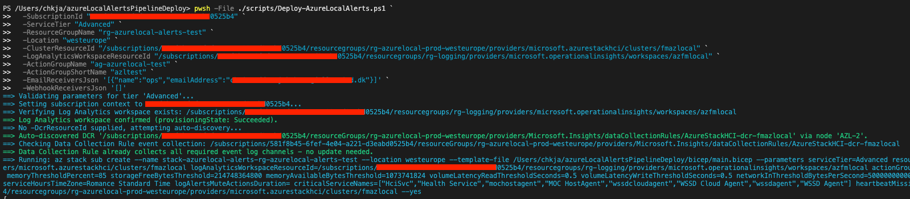
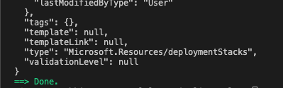
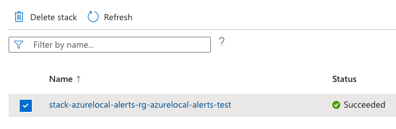
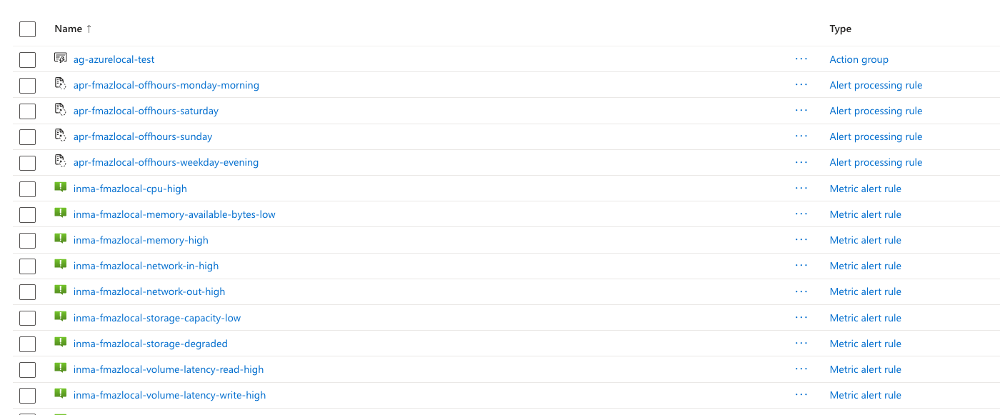
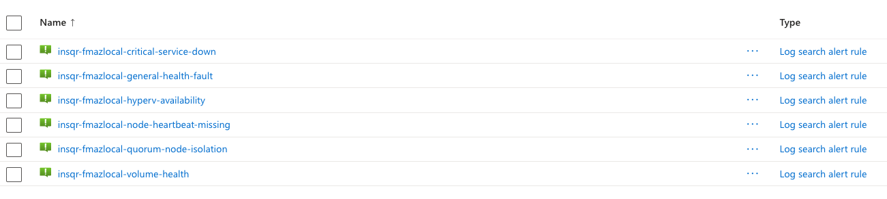

# azureLocalAlertsPipelineDeploy

Pipeline-based deployment of Azure Local alert rules (Action Group + metric/log alerts), aligned
to the Basic / Advanced / Premium tiers of the Azure Local Managed Service.

> **Note:** everything under `pipeline/` (`azure-pipelines.yml` and `pipeline/environments/*.yml`)
> is written in **Azure DevOps YAML pipeline** syntax (`trigger:`/`pool:`/`stages:`/`jobs:`/
> `task: AzureCLI@2`, etc.) and only runs in Azure DevOps - it is **not** compatible with GitHub
> Actions workflows, which use a different schema (`on:`/`runs-on:`/`uses:`). The Bicep templates
> and `scripts/Deploy-AzureLocalAlerts.ps1` are platform-agnostic and can be run from anywhere
> (see "Deploy locally" below); only the CI/CD orchestration in `pipeline/` is Azure DevOps-specific.

See **[docs/service-tiers-and-alerts.md](docs/service-tiers-and-alerts.md)** for the full tier-to-alert
mapping, the KQL/CLI exploration commands, and how drift prevention works.

## What's in the repo

| Path | Purpose |
|---|---|
| `bicep/main.bicep` | Subscription-scope entry point (optionally creates the RG) |
| `bicep/modules/alerts.bicep` | Resource-group scope orchestrator; gates alerts by `serviceTier` |
| `bicep/modules/actionGroup.bicep` | Action Group with email + webhook receivers |
| `bicep/modules/metricAlerts.bicep` | Platform metric alerts (storage degraded, CPU, memory) |
| `bicep/modules/logAlerts.bicep` | Log Analytics scheduled query alerts (heartbeat, volume health, error-rate) |
| `scripts/Deploy-AzureLocalAlerts.ps1` | Validates inputs, then runs `az stack sub create` (or `validate`); accepts either explicit `-Parameter Value` flags or a single `-BicepParamFile` |
| `scripts/src/powershell/*.ps1` | One file per helper function used by `Deploy-AzureLocalAlerts.ps1` (dot-sourced automatically at startup) |
| `pipeline/azure-pipelines.yml` | **Azure DevOps** CD pipeline (Azure DevOps YAML syntax only - not usable as a GitHub Actions workflow) |
| `pipeline/environments/*.bicepparam` | Per-tenant/cluster Bicep template parameters: tier, resource IDs, thresholds, receivers, etc. |
| `pipeline/environments/*.yml` | Per-tenant/cluster pipeline metadata only: service connection, subscription ID, DCR resource ID, and a pointer to the companion `.bicepparam` file |

## Quick start

1. **Deploy locally** for a quick test (creates/updates an Azure Deployment Stack with
   `--deny-settings-mode denyDelete`, so managed resources can't be deleted outside the stack).
   Two ways to pass parameters:
   - **`.bicepparam` file** (recommended - same file the pipeline uses):
     ```powershell
     az login
     pwsh -File scripts/Deploy-AzureLocalAlerts.ps1 `
       -SubscriptionId "<sub-id>" `
       -BicepParamFile "pipeline/environments/example-customera-basic.bicepparam" `
       -DcrResourceId "<dcr-resource-id>" `   # optional; omit/leave empty for Basic tier
       -WhatIf   # drop this switch to actually deploy (runs `az stack sub validate` vs `create`)
     ```
   - **Explicit parameters** (no `.bicepparam` file needed - useful for quick ad-hoc tests):
     ```powershell
     az login
     pwsh -File scripts/Deploy-AzureLocalAlerts.ps1 `
       -SubscriptionId "<sub-id>" `
       -ServiceTier "Advanced" `
       -ResourceGroupName "rg-azurelocal-customera-prod" `
       -Location "westeurope" `
       -ClusterResourceId "/subscriptions/.../Microsoft.AzureStackHCI/clusters/<name>" `
       -LogAnalyticsWorkspaceResourceId "/subscriptions/.../Microsoft.OperationalInsights/workspaces/<law>" `
       -ActionGroupName "ag-azurelocal-customera-prod" `
       -ActionGroupShortName "azlalerts" `
       -EmailReceiversJson '[{"name":"ops","emailAddress":"ops@example.com"}]' `
       -WebhookReceiversJson '[{"name":"itsm","serviceUri":"https://example.com/webhook"}]' `
       -WhatIf   # drop this switch to actually deploy (runs `az stack sub validate` vs `create`)
     ```
   The resource group is always created/ensured as part of this deployment (no separate toggle).
2. **Onboard via pipeline**: copy `pipeline/environments/example-customera-basic.bicepparam` (tier,
   thresholds, receivers, resource IDs) and `example-customera-basic.yml` (service connection,
   subscription ID, DCR resource ID) to a new pair of files named after your customer/cluster, fill
   in both, add the base file name to the `environmentFile` parameter list in
   `pipeline/azure-pipelines.yml`, and merge to `main`.

## What it looks like

Running the script deploys the Action Group, Alert Processing Rules (off-hours suppression),
and metric/log alerts as a single Azure Deployment Stack. The screenshot below shows a one-off
**local** run (via `pwsh -File scripts/Deploy-AzureLocalAlerts.ps1`, as in the "Deploy locally"
quick-start step) - useful for ad-hoc testing, but not how this should run day-to-day: onboarded
customers/clusters should go through the **pipeline** (`pipeline/azure-pipelines.yml`) instead.
Today that pipeline only triggers on a push to `main` touching `bicep/**`/`pipeline/environments/**`
(see the pipeline's header comments); add a
[`schedules:`](https://learn.microsoft.com/azure/devops/pipelines/process/scheduled-triggers)
trigger (e.g. daily) so it also re-applies automatically on a recurring cadence, catching any
manual portal drift even when nobody has pushed a config change.





The resulting deployment stack shows as `Succeeded` in the portal:



...and the managed resource group contains the Action Group, off-hours suppression rules, and
metric alert rules:



...plus the Advanced/Premium log search alert rules (heartbeat, quorum, volume health, critical
service down, general Health Service faults, Hyper-V availability):



## Prerequisites

- Azure DevOps ARM service connection per tenant/subscription (name referenced by
  `serviceConnection` in each environment file).
- Azure CLI >= 2.61 (for the built-in `az stack` command) + Bicep (bundled on Microsoft-hosted
  `ubuntu-latest` agents). Older CLI versions get the `deployment-stacks` extension installed
  automatically by `Deploy-AzureLocalAlerts.ps1`.
- The service connection's principal needs `Contributor` (or equivalent) at the subscription (or
  target resource group) scope - deployment stacks with `denyDelete` still require write access
  to create/update the stack and its managed resources.
- For Advanced/Premium: Log Analytics workspace + DCR/DCE already collecting Azure Local Insights
  data (see [Azure Local - Insights and Logging - Part 1](https://chkja.dk/blog/azure-local-insights-part1)).
